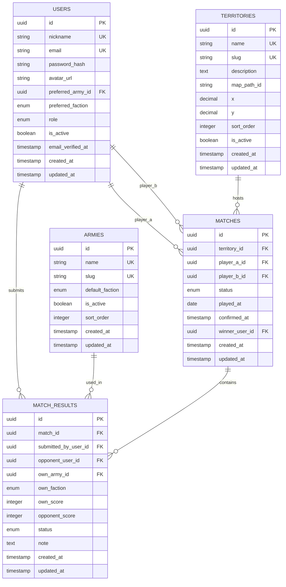

# Specifiche tecniche schematiche — Portale Campagna Wargame

> Documento pensato per essere dato in input a un altro LLM o a un team tecnico.  
> Linguaggio: italiano.  
> Dominio: portale web per registrazione risultati di partite di Warhammer: The Old World, gestione territori, fazioni, armate e conferma incrociata dei match.

---

## 1. Obiettivo del progetto

Realizzare una semplice applicazione web con database persistente che permetta a utenti registrati di:

1. Creare un account, autenticarsi e recuperare la password.
2. Configurare il proprio profilo, inclusi nickname, email, immagine profilo, armata preferita e dati personali minimi.
3. Inserire il risultato di una partita di wargame.
4. Selezionare:
   - propria armata;
   - propria fazione;
   - territorio per cui si combatte;
   - nickname dell'avversario;
   - punti propri;
   - punti dell'avversario.
5. Confermare automaticamente una partita quando entrambi i giocatori inseriscono risultati compatibili.
6. Visualizzare una mappa centrale dei territori.
7. Aprire il dettaglio di un territorio cliccandolo sulla mappa.
8. Vedere nel dettaglio territorio:
   - battaglie giocate su quel territorio;
   - percentuale di controllo per fazione;
   - percentuale di controllo per armata;
   - storico dei match confermati.
9. Gestire dal menu:
   - profilo utente;
   - cambio email;
   - cambio immagine profilo;
   - cambio password;
   - inserimento risultati.

---

## 2. Glossario dominio

| Termine | Definizione |
|---|---|
| Utente | Persona registrata al portale. Può inserire risultati e gestire il profilo. |
| Armata | Esercito giocato dall'utente, es. Orc & Goblin Tribes, Dwarfen Mountain Holds, Empire of Man. |
| Fazione | Macro-schieramento politico/tematico. Valori iniziali: `RAVAGING_HORDES`, `FORCES_OF_FANTASY`, `UNDEAD`. |
| Territorio | Area della mappa per cui gli utenti combattono. Ogni match è associato a un territorio. |
| Risultato | Inserimento singolo fatto da un utente relativamente a una partita. |
| Match | Entità logica che rappresenta una partita tra due utenti. Un match può contenere uno o due risultati. |
| Match confermato | Match in cui entrambi gli utenti hanno inserito un risultato coerente. |
| Match pendente | Match inserito da un solo utente oppure con dati non ancora verificabili. |
| Controllo territorio | Percentuale calcolata in base ai risultati confermati associati a un territorio. |

---

## 3. Ruoli applicativi

### 3.1 Utente anonimo

Permessi:

- Visualizza pagina login.
- Visualizza pagina registrazione.
- Richiede recupero password.
- Non può inserire risultati.
- Non può modificare profili.
- Opzionale: può vedere la mappa pubblica in sola lettura, se abilitato da configurazione.

### 3.2 Utente autenticato

Permessi:

- Accede alla dashboard.
- Visualizza mappa territori.
- Visualizza dettagli territorio.
- Inserisce risultati partita.
- Visualizza i propri risultati pendenti e confermati.
- Modifica il proprio profilo.
- Cambia password.
- Cambia email.
- Carica o aggiorna immagine profilo.

### 3.3 Admin opzionale, non obbligatorio per MVP

Permessi consigliati per una versione successiva:

- Gestisce lista territori.
- Gestisce lista armate.
- Modera o annulla match.
- Risolve match in conflitto.
- Blocca utenti.
- Corregge dati inseriti erroneamente.

---

## 4. Requisiti funzionali

### RF-001 — Registrazione utente

L'applicazione deve permettere a un nuovo utente di registrarsi.

Campi minimi:

| Campo | Obbligatorio | Note |
|---|---:|---|
| nickname | sì | Univoco. Usato per trovare l'avversario. |
| email | sì | Univoca. Usata per login e recupero password. |
| password | sì | Salvata solo come hash. |
| conferma password | sì | Solo frontend/backend validation, non salvata. |

Validazioni:

- nickname non vuoto;
- nickname univoco case-insensitive;
- email valida;
- email univoca case-insensitive;
- password con policy minima configurabile;
- password e conferma password devono coincidere.

Output:

- account creato;
- utente loggato automaticamente oppure redirect a login;
- eventuale email di verifica opzionale.

---

### RF-002 — Login

L'applicazione deve permettere il login con:

- email + password;
- oppure nickname + password, se si desidera supportarlo.

Comportamento:

- se credenziali valide: crea sessione o token JWT;
- se credenziali non valide: errore generico, senza indicare se email/nickname esiste.

---

### RF-003 — Logout

L'utente autenticato può effettuare logout.

Comportamento:

- invalidazione sessione lato server, se session based;
- cancellazione cookie/sessione lato client;
- redirect a login o home pubblica.

---

### RF-004 — Recupero password

Flusso:

1. Utente inserisce email.
2. Sistema genera token temporaneo monouso.
3. Sistema invia email con link reset.
4. Utente apre link.
5. Utente imposta nuova password.
6. Token viene invalidato.

Vincoli:

- token con scadenza consigliata: 30-60 minuti;
- token salvato hashato nel DB;
- messaggio sempre generico: "Se l'email esiste, riceverai istruzioni".

---

### RF-005 — Gestione profilo

L'utente può modificare:

| Campo | Note |
|---|---|
| nickname | Opzionale: meglio renderlo non modificabile o modificabile con regole rigide. |
| email | Deve restare univoca. Opzionale conferma via email. |
| immagine profilo | Upload immagine. |
| armata preferita | Valore da lista armate. |
| fazione preferita | Valore da enum fazioni. |

Per cambio password:

- password attuale obbligatoria;
- nuova password;
- conferma nuova password;
- invalidare eventuali sessioni/token precedenti, opzionale ma consigliato.

---

### RF-006 — Visualizzazione mappa territori

Dashboard principale dopo login.

Requisiti UI:

- al centro pagina viene mostrata una mappa dei territori;
- ogni territorio è cliccabile;
- ogni territorio può mostrare un colore/overlay in base alla fazione dominante;
- ogni territorio può mostrare tooltip con dati sintetici:
  - nome territorio;
  - fazione dominante;
  - numero battaglie confermate;
  - percentuali principali.

Dati necessari:

- lista territori;
- statistiche aggregate per territorio;
- eventuali coordinate o geometrie SVG/HTML per renderizzare la mappa.

---

### RF-007 — Dettaglio territorio

Quando l'utente clicca un territorio, si apre una vista dettaglio.

Informazioni da mostrare:

1. Nome territorio.
2. Descrizione, se presente.
3. Numero totale battaglie confermate.
4. Numero totale battaglie pendenti, opzionale solo per admin o per utenti coinvolti.
5. Percentuale controllo per fazione.
6. Percentuale controllo per armata.
7. Lista ultime battaglie confermate.
8. Eventuale storico completo paginato.

Battaglie mostrate:

| Campo | Note |
|---|---|
| data partita | Data dichiarata dall'utente o data conferma. |
| giocatore A | Nickname. |
| armata A | Armata. |
| fazione A | Fazione. |
| punti A | Punti segnati. |
| giocatore B | Nickname. |
| armata B | Armata. |
| fazione B | Fazione. |
| punti B | Punti segnati. |
| esito | Vittoria A, Vittoria B, pareggio, opzionale. |

---

### RF-008 — Inserimento risultato partita

L'utente autenticato può inserire un risultato.

Campi form:

| Campo | Tipo | Obbligatorio | Note |
|---|---|---:|---|
| territory_id | select | sì | Territorio per cui si combatte. |
| own_army_id | select | sì | Armata giocata dall'utente. |
| own_faction | select enum | sì | Fazione dell'utente. |
| opponent_nickname | text/autocomplete | sì | Nickname dell'avversario registrato. |
| own_score | integer | sì | Punti fatti dall'utente. |
| opponent_score | integer | sì | Punti fatti dall'avversario. |
| played_at | date | consigliato | Data partita. Default oggi. |
| note | text | no | Note opzionali. |

Validazioni:

- utente autenticato;
- territorio esistente e attivo;
- armata esistente e attiva;
- fazione valida;
- opponent_nickname deve corrispondere a un utente registrato;
- opponent_nickname non può essere uguale al nickname dell'utente corrente;
- own_score >= 0;
- opponent_score >= 0;
- played_at non futura, salvo configurazione;
- non consentire duplicati evidenti.

---

### RF-009 — Match pendente

Quando un utente inserisce un risultato e non esiste ancora il risultato speculare dell'avversario:

- viene creato un `match` con stato `PENDING`;
- viene creato un `match_result` associato a quel match;
- il match attende l'inserimento dell'avversario.

---

### RF-010 — Conferma automatica match

Quando l'avversario inserisce a sua volta il risultato, il sistema deve verificare se i due risultati sono coerenti.

Due risultati sono coerenti se:

- riguardano gli stessi due utenti;
- riguardano lo stesso territorio;
- hanno data compatibile, con tolleranza configurabile;
- il punteggio dichiarato da A per sé coincide con il punteggio dichiarato da B per A;
- il punteggio dichiarato da A per B coincide con il punteggio dichiarato da B per sé.

Esempio:

Risultato inserito da A:

```text
A dichiara:
- proprio punteggio = 12
- punteggio avversario B = 8
```

Risultato inserito da B:

```text
B dichiara:
- proprio punteggio = 8
- punteggio avversario A = 12
```

Il match è confermato.

Se coerente:

- `match.status = CONFIRMED`;
- `match.confirmed_at = now()`;
- entrambi i `match_result.status = CONFIRMED`;
- il match entra nei calcoli statistiche territori.

Se non coerente:

- il sistema può creare o mantenere un match in stato `CONFLICT`;
- i risultati non entrano nelle statistiche;
- opzionale: notificare entrambi gli utenti;
- opzionale: admin può risolvere.

---

### RF-011 — Prevenzione duplicati match

Il sistema deve evitare che la stessa partita venga registrata molte volte.

Criteri consigliati per individuare duplicati:

- stessi due utenti;
- stesso territorio;
- stessa data partita;
- stessi punteggi incrociati;
- stessa armata e fazione per ciascun utente.

Strategia minima MVP:

- prima di creare un nuovo match pendente, cercare match pendenti compatibili tra i due utenti e territorio;
- se esiste match pendente compatibile, agganciare il secondo risultato a quel match;
- se esiste match confermato identico, bloccare inserimento o mostrare warning.

---

### RF-012 — Calcolo controllo territorio

Solo i match confermati devono essere usati per le statistiche.

La percentuale per fazione può essere calcolata in vari modi. Per MVP scegliere una regola semplice.

Regola consigliata MVP:

- ogni match confermato assegna punti territorio in base ai punti partita;
- per ogni territorio, sommare i punti ottenuti da ogni fazione;
- percentuale fazione = punti fazione / totale punti territorio * 100.

Formula:

```text
faction_control_percentage = faction_score_sum / all_factions_score_sum * 100
```

Esempio:

```text
Territorio X:
- Forces of Fantasy: 120 punti
- Ravaging Hordes: 80 punti
- Undead: 50 punti
Totale: 250
Percentuali:
- Forces of Fantasy: 48%
- Ravaging Hordes: 32%
- Undead: 20%
```

Regola alternativa:

- contare vittorie invece che punti;
- pareggio distribuisce mezzo punto a ciascuno;
- vittoria assegna 1 controllo point alla fazione vincente.

La regola deve essere configurabile nel codice, ma per MVP usare somma punti.

---

### RF-013 — Calcolo controllo per armata

Analogo al controllo per fazione, ma aggregato per `army_id`.

Formula consigliata:

```text
army_control_percentage = army_score_sum / all_armies_score_sum * 100
```

Solo match confermati.

---

### RF-014 — Menu applicativo

Menu utente autenticato:

| Voce | Destinazione |
|---|---|
| Mappa | Dashboard con mappa territori. |
| Inserisci risultato | Form nuovo risultato partita. |
| I miei risultati | Lista risultati inseriti dall'utente. |
| Profilo | Modifica email, immagine, dati profilo. |
| Cambia password | Form cambio password. |
| Logout | Termina sessione. |

---

## 5. Requisiti non funzionali

### RNF-001 — Sicurezza autenticazione

- Password mai salvate in chiaro.
- Usare hashing robusto: Argon2id, bcrypt o equivalente.
- Cookie sessione `HttpOnly`, `Secure`, `SameSite=Lax/Strict` se session based.
- Protezione CSRF se si usano cookie sessione.
- Rate limit su login e recupero password.

### RNF-002 — Validazione dati

- Validazione lato frontend per UX.
- Validazione lato backend obbligatoria.
- Sanitizzazione output per evitare XSS.

### RNF-003 — Performance

- La dashboard deve caricare rapidamente.
- Le statistiche territorio possono essere calcolate on demand o preaggregate.
- Per MVP è accettabile il calcolo on demand se dataset piccolo.
- Per dataset più grande, creare tabella/materialized view `territory_statistics`.

### RNF-004 — Audit minimo

Salvare:

- created_at;
- updated_at;
- confirmed_at per match;
- deleted_at per soft delete opzionale;
- created_by dove utile.

### RNF-005 — Privacy

- Non mostrare email utenti ad altri utenti.
- Mostrare nickname e immagine profilo.
- Immagini profilo con dimensione e tipo file limitati.

### RNF-006 — Esperienza utente moderna e coerente col dominio

L'applicazione deve avere un feel & look moderno, leggibile e immersivo, con richiami visivi a Warhammer: The Old World senza replicarne asset proprietari.

Linee guida UX/UI:

- estetica fantasy-bellica elegante, con forte personalità visiva;
- uso di palette cromatiche ispirate a pergamena, acciaio, ottone, pietra, rosso araldico e tonalità cupe/desaturate;
- tipografia con gerarchia marcata tra titoli, contenuti e dati statistici;
- interfaccia moderna, pulita e non eccessivamente caricata;
- componenti con look rifinito: card, pannelli, badge fazione, tabelle e modali;
- mappa territorio come elemento centrale e scenografico dell'esperienza.

Vincoli:

- evitare dipendenza da asset grafici proprietari non licenziati;
- predisporre spazi e placeholder sostituibili per loghi, stemmi, banner e immagini ufficiali;
- mantenere accessibilità e leggibilità anche su schermi piccoli.

### RNF-007 — Responsive design e usabilità mobile completa

L'applicazione deve essere progettata mobile-first ed essere completamente utilizzabile da smartphone, senza funzioni degradate.

Requisiti:

- tutte le funzionalità core devono essere fruibili da mobile: login, registrazione, mappa, dettaglio territorio, inserimento risultato, gestione profilo;
- layout responsive con breakpoint almeno per mobile, tablet e desktop;
- form ottimizzati per touch, con aree cliccabili ampie e feedback chiari;
- menu di navigazione compatto su mobile, preferibilmente drawer, bottom navigation oppure top bar condensata;
- tabelle o liste statistiche adattate a card stack o layout scorrevoli su schermi piccoli;
- la mappa deve restare consultabile da mobile tramite zoom, pan o semplificazioni UX equivalenti;
- priorità a performance e leggibilità su rete mobile.

### RNF-008 — Predisposizione branding e contenuti istituzionali

Il frontend deve prevedere zone configurabili per branding e contenuti istituzionali.

Elementi richiesti:

- placeholder per logo principale applicazione;
- placeholder per logo o stemma della federazione/associazione;
- eventuale area hero o header con titolo campagna e sottotitolo configurabile;
- supporto a immagini decorative o banner per eventi/campagne future.

Footer obbligatorio:

- nome applicazione;
- versione applicativa;
- anno e intestazione organizzativa;
- link o sezioni per note legali;
- link o sezioni per privacy policy;
- link o sezioni per cookie policy, se necessaria;
- eventuale contatto organizzativo o email di riferimento.

Nota: i contenuti testuali del footer devono essere configurabili, così da poter essere aggiornati senza modificare il layout generale.

### RNF-009 — Architettura frontend consigliata

Per il frontend è consigliata una architettura Single Page Application, purché non introduca complessità eccessiva rispetto al backend PHP/MySQL.

Indicazioni:

- preferire frontend separato che consumi API REST backend;
- mantenere una struttura component-based e facilmente estendibile;
- prevedere gestione centralizzata di autenticazione, stato utente e cache dati;
- supportare routing client-side per dashboard, dettaglio territorio, profilo e inserimento risultati;
- prevedere possibilità futura di trasformazione in PWA, opzionale ma consigliata.

Nota progettuale:

- la scelta SPA è consigliata perché la UX ruota attorno a dashboard, mappa interattiva, navigazione fluida tra territori e aggiornamento dati frequente;
- resta comunque valida una architettura ibrida server-rendered + componenti interattivi se si desidera ridurre complessità iniziale.

---

## 6. Entità principali

### 6.1 User

Rappresenta un utente registrato.

Campi:

| Campo | Tipo | Vincoli |
|---|---|---|
| id | UUID / bigint | PK |
| nickname | varchar | unique, not null |
| email | varchar | unique, not null |
| password_hash | varchar | not null |
| avatar_url | varchar | nullable |
| preferred_army_id | FK armies.id | nullable |
| preferred_faction | enum faction | nullable |
| role | enum user_role | default USER |
| is_active | boolean | default true |
| email_verified_at | timestamp | nullable |
| created_at | timestamp | not null |
| updated_at | timestamp | not null |

---

### 6.2 Army

Rappresenta una armata selezionabile.

Campi:

| Campo | Tipo | Vincoli |
|---|---|---|
| id | UUID / bigint | PK |
| name | varchar | unique, not null |
| slug | varchar | unique, not null |
| default_faction | enum faction | nullable |
| is_active | boolean | default true |
| sort_order | integer | default 0 |
| created_at | timestamp | not null |
| updated_at | timestamp | not null |

Nota: una armata può avere una fazione di default ma il form può comunque richiedere la fazione esplicita, perché il requisito indica che l'utente seleziona entrambe.

---

### 6.3 Faction

Può essere implementata come enum.

Valori iniziali:

```text
RAVAGING_HORDES
FORCES_OF_FANTASY
UNDEAD
```

Label UI:

| Enum | Label |
|---|---|
| RAVAGING_HORDES | Ravaging Hordes |
| FORCES_OF_FANTASY | Forces of Fantasy |
| UNDEAD | Undead |

Nota: nel testo utente originale compare "Force o fantasy"; normalizzare come `Forces of Fantasy`.

---

### 6.4 Territory

Rappresenta un territorio della mappa.

Campi:

| Campo | Tipo | Vincoli |
|---|---|---|
| id | UUID / bigint | PK |
| name | varchar | unique, not null |
| slug | varchar | unique, not null |
| description | text | nullable |
| map_path_id | varchar | nullable, id elemento SVG |
| x | decimal | nullable, coordinata mappa semplice |
| y | decimal | nullable, coordinata mappa semplice |
| sort_order | integer | default 0 |
| is_active | boolean | default true |
| created_at | timestamp | not null |
| updated_at | timestamp | not null |

Territori iniziali:

```text
Da definire: lista di territori richiesta dal dominio.
Il sistema deve supportare una lista configurabile di territori.
```

---

### 6.5 Match

Entità logica della partita. Contiene due risultati agganciati.

Campi:

| Campo | Tipo | Vincoli |
|---|---|---|
| id | UUID / bigint | PK |
| territory_id | FK territories.id | not null |
| player_a_id | FK users.id | not null |
| player_b_id | FK users.id | not null |
| status | enum match_status | not null |
| played_at | date | nullable/not null consigliato |
| confirmed_at | timestamp | nullable |
| winner_user_id | FK users.id | nullable |
| created_at | timestamp | not null |
| updated_at | timestamp | not null |

Enum `match_status`:

```text
PENDING
CONFIRMED
CONFLICT
CANCELLED
```

Regole:

- `player_a_id != player_b_id`;
- un match può avere massimo due `match_results`, uno per giocatore;
- solo match `CONFIRMED` usati in statistiche;
- `winner_user_id` calcolato dai punteggi, nullable in caso di pareggio.

---

### 6.6 MatchResult

Rappresenta l'inserimento del risultato da parte di un singolo utente.

Campi:

| Campo | Tipo | Vincoli |
|---|---|---|
| id | UUID / bigint | PK |
| match_id | FK matches.id | not null |
| submitted_by_user_id | FK users.id | not null |
| opponent_user_id | FK users.id | not null |
| own_army_id | FK armies.id | not null |
| own_faction | enum faction | not null |
| own_score | integer | not null, >= 0 |
| opponent_score | integer | not null, >= 0 |
| status | enum result_status | default PENDING |
| note | text | nullable |
| created_at | timestamp | not null |
| updated_at | timestamp | not null |

Enum `result_status`:

```text
PENDING
CONFIRMED
CONFLICT
CANCELLED
```

Vincoli:

- unique `(match_id, submitted_by_user_id)`;
- `submitted_by_user_id != opponent_user_id`;
- massimo 2 risultati per match.

---

### 6.7 PasswordResetToken

Campi:

| Campo | Tipo | Vincoli |
|---|---|---|
| id | UUID / bigint | PK |
| user_id | FK users.id | not null |
| token_hash | varchar | not null |
| expires_at | timestamp | not null |
| used_at | timestamp | nullable |
| created_at | timestamp | not null |

---

### 6.8 Optional: TerritoryStatistic

Tabella opzionale di cache/preaggregazione.

Campi:

| Campo | Tipo | Vincoli |
|---|---|---|
| id | UUID / bigint | PK |
| territory_id | FK territories.id | not null |
| computed_at | timestamp | not null |
| total_confirmed_matches | integer | not null |
| faction_breakdown_json | json | not null |
| army_breakdown_json | json | not null |
| dominant_faction | enum faction | nullable |
| dominant_army_id | FK armies.id | nullable |

Per MVP può non esistere. Le statistiche possono essere calcolate via query.

---

## 7. Schema relazionale consigliato



---

## 8. DDL SQL indicativo PostgreSQL

```sql
CREATE TYPE faction AS ENUM (
  'RAVAGING_HORDES',
  'FORCES_OF_FANTASY',
  'UNDEAD'
);

CREATE TYPE user_role AS ENUM (
  'USER',
  'ADMIN'
);

CREATE TYPE match_status AS ENUM (
  'PENDING',
  'CONFIRMED',
  'CONFLICT',
  'CANCELLED'
);

CREATE TYPE result_status AS ENUM (
  'PENDING',
  'CONFIRMED',
  'CONFLICT',
  'CANCELLED'
);

CREATE TABLE armies (
  id UUID PRIMARY KEY DEFAULT gen_random_uuid(),
  name VARCHAR(120) NOT NULL UNIQUE,
  slug VARCHAR(140) NOT NULL UNIQUE,
  default_faction faction NULL,
  is_active BOOLEAN NOT NULL DEFAULT TRUE,
  sort_order INTEGER NOT NULL DEFAULT 0,
  created_at TIMESTAMP NOT NULL DEFAULT now(),
  updated_at TIMESTAMP NOT NULL DEFAULT now()
);

CREATE TABLE users (
  id UUID PRIMARY KEY DEFAULT gen_random_uuid(),
  nickname VARCHAR(80) NOT NULL UNIQUE,
  email VARCHAR(255) NOT NULL UNIQUE,
  password_hash VARCHAR(255) NOT NULL,
  avatar_url VARCHAR(500) NULL,
  preferred_army_id UUID NULL REFERENCES armies(id),
  preferred_faction faction NULL,
  role user_role NOT NULL DEFAULT 'USER',
  is_active BOOLEAN NOT NULL DEFAULT TRUE,
  email_verified_at TIMESTAMP NULL,
  created_at TIMESTAMP NOT NULL DEFAULT now(),
  updated_at TIMESTAMP NOT NULL DEFAULT now()
);

CREATE TABLE territories (
  id UUID PRIMARY KEY DEFAULT gen_random_uuid(),
  name VARCHAR(120) NOT NULL UNIQUE,
  slug VARCHAR(140) NOT NULL UNIQUE,
  description TEXT NULL,
  map_path_id VARCHAR(120) NULL,
  x NUMERIC(10, 4) NULL,
  y NUMERIC(10, 4) NULL,
  sort_order INTEGER NOT NULL DEFAULT 0,
  is_active BOOLEAN NOT NULL DEFAULT TRUE,
  created_at TIMESTAMP NOT NULL DEFAULT now(),
  updated_at TIMESTAMP NOT NULL DEFAULT now()
);

CREATE TABLE matches (
  id UUID PRIMARY KEY DEFAULT gen_random_uuid(),
  territory_id UUID NOT NULL REFERENCES territories(id),
  player_a_id UUID NOT NULL REFERENCES users(id),
  player_b_id UUID NOT NULL REFERENCES users(id),
  status match_status NOT NULL DEFAULT 'PENDING',
  played_at DATE NULL,
  confirmed_at TIMESTAMP NULL,
  winner_user_id UUID NULL REFERENCES users(id),
  created_at TIMESTAMP NOT NULL DEFAULT now(),
  updated_at TIMESTAMP NOT NULL DEFAULT now(),
  CONSTRAINT chk_match_different_players CHECK (player_a_id <> player_b_id)
);

CREATE TABLE match_results (
  id UUID PRIMARY KEY DEFAULT gen_random_uuid(),
  match_id UUID NOT NULL REFERENCES matches(id) ON DELETE CASCADE,
  submitted_by_user_id UUID NOT NULL REFERENCES users(id),
  opponent_user_id UUID NOT NULL REFERENCES users(id),
  own_army_id UUID NOT NULL REFERENCES armies(id),
  own_faction faction NOT NULL,
  own_score INTEGER NOT NULL CHECK (own_score >= 0),
  opponent_score INTEGER NOT NULL CHECK (opponent_score >= 0),
  status result_status NOT NULL DEFAULT 'PENDING',
  note TEXT NULL,
  created_at TIMESTAMP NOT NULL DEFAULT now(),
  updated_at TIMESTAMP NOT NULL DEFAULT now(),
  CONSTRAINT chk_result_different_players CHECK (submitted_by_user_id <> opponent_user_id),
  CONSTRAINT uq_match_result_user UNIQUE (match_id, submitted_by_user_id)
);

CREATE TABLE password_reset_tokens (
  id UUID PRIMARY KEY DEFAULT gen_random_uuid(),
  user_id UUID NOT NULL REFERENCES users(id) ON DELETE CASCADE,
  token_hash VARCHAR(255) NOT NULL,
  expires_at TIMESTAMP NOT NULL,
  used_at TIMESTAMP NULL,
  created_at TIMESTAMP NOT NULL DEFAULT now()
);

CREATE INDEX idx_matches_territory_status ON matches(territory_id, status);
CREATE INDEX idx_matches_players ON matches(player_a_id, player_b_id);
CREATE INDEX idx_match_results_submitted_by ON match_results(submitted_by_user_id);
CREATE INDEX idx_match_results_opponent ON match_results(opponent_user_id);
```

---

## 9. API REST consigliate

Base path:

```text
/api
```

Autenticazione:

- cookie sessione oppure JWT;
- negli esempi si assume autenticazione richiesta dove indicato.

---

### 9.1 Auth

#### POST /api/auth/register

Crea nuovo utente.

Request:

```json
{
  "nickname": "PlayerOne",
  "email": "player@example.com",
  "password": "PasswordSicura123!",
  "password_confirmation": "PasswordSicura123!"
}
```

Response 201:

```json
{
  "user": {
    "id": "uuid",
    "nickname": "PlayerOne",
    "email": "player@example.com",
    "avatar_url": null
  }
}
```

---

#### POST /api/auth/login

Request:

```json
{
  "login": "player@example.com",
  "password": "PasswordSicura123!"
}
```

Response 200:

```json
{
  "user": {
    "id": "uuid",
    "nickname": "PlayerOne",
    "email": "player@example.com",
    "avatar_url": null
  }
}
```

---

#### POST /api/auth/logout

Autenticazione richiesta.

Response 204.

---

#### POST /api/auth/password/forgot

Request:

```json
{
  "email": "player@example.com"
}
```

Response 200:

```json
{
  "message": "Se l'email esiste, riceverai le istruzioni per il reset."
}
```

---

#### POST /api/auth/password/reset

Request:

```json
{
  "token": "plain-token-from-email",
  "password": "NuovaPassword123!",
  "password_confirmation": "NuovaPassword123!"
}
```

Response 200:

```json
{
  "message": "Password aggiornata con successo."
}
```

---

### 9.2 Profilo

#### GET /api/me

Autenticazione richiesta.

Response:

```json
{
  "id": "uuid",
  "nickname": "PlayerOne",
  "email": "player@example.com",
  "avatar_url": "https://...",
  "preferred_army": {
    "id": "uuid",
    "name": "Empire of Man"
  },
  "preferred_faction": "FORCES_OF_FANTASY"
}
```

---

#### PATCH /api/me/profile

Autenticazione richiesta.

Request:

```json
{
  "email": "newmail@example.com",
  "preferred_army_id": "uuid",
  "preferred_faction": "FORCES_OF_FANTASY"
}
```

Response 200: utente aggiornato.

---

#### POST /api/me/avatar

Autenticazione richiesta.

Content-Type:

```text
multipart/form-data
```

Campo:

```text
avatar: file immagine
```

Vincoli:

- max 2 MB;
- MIME consentiti: image/jpeg, image/png, image/webp;
- ridimensionamento lato server consigliato.

---

#### POST /api/me/password

Autenticazione richiesta.

Request:

```json
{
  "current_password": "PasswordAttuale123!",
  "new_password": "NuovaPassword123!",
  "new_password_confirmation": "NuovaPassword123!"
}
```

Response 200.

---

### 9.3 Lookup dati

#### GET /api/armies

Response:

```json
[
  {
    "id": "uuid",
    "name": "Empire of Man",
    "slug": "empire-of-man",
    "default_faction": "FORCES_OF_FANTASY"
  }
]
```

---

#### GET /api/factions

Response:

```json
[
  { "value": "RAVAGING_HORDES", "label": "Ravaging Hordes" },
  { "value": "FORCES_OF_FANTASY", "label": "Forces of Fantasy" },
  { "value": "UNDEAD", "label": "Undead" }
]
```

---

#### GET /api/territories

Response:

```json
[
  {
    "id": "uuid",
    "name": "Northern Wastes",
    "slug": "northern-wastes",
    "description": "...",
    "map_path_id": "territory-northern-wastes",
    "x": 10.5,
    "y": 20.0
  }
]
```

---

#### GET /api/users/search?nickname=abc

Autenticazione richiesta.

Serve per autocomplete avversario.

Response:

```json
[
  {
    "id": "uuid",
    "nickname": "OpponentNick",
    "avatar_url": "https://..."
  }
]
```

Non esporre email.

---

### 9.4 Match e risultati

#### POST /api/match-results

Autenticazione richiesta.

Inserisce risultato partita.

Request:

```json
{
  "territory_id": "uuid",
  "own_army_id": "uuid",
  "own_faction": "FORCES_OF_FANTASY",
  "opponent_nickname": "OpponentNick",
  "own_score": 12,
  "opponent_score": 8,
  "played_at": "2026-05-18",
  "note": "Partita combattuta fino all'ultimo turno."
}
```

Response 201, match creato pendente:

```json
{
  "match": {
    "id": "uuid",
    "status": "PENDING",
    "territory_id": "uuid",
    "played_at": "2026-05-18"
  },
  "result": {
    "id": "uuid",
    "status": "PENDING"
  },
  "confirmation": {
    "confirmed": false,
    "message": "Risultato inserito. In attesa dell'avversario."
  }
}
```

Response 201/200, match confermato:

```json
{
  "match": {
    "id": "uuid",
    "status": "CONFIRMED",
    "territory_id": "uuid",
    "played_at": "2026-05-18",
    "confirmed_at": "2026-05-18T12:00:00Z",
    "winner_user_id": "uuid"
  },
  "result": {
    "id": "uuid",
    "status": "CONFIRMED"
  },
  "confirmation": {
    "confirmed": true,
    "message": "Match confermato automaticamente."
  }
}
```

Response conflitto:

```json
{
  "match": {
    "id": "uuid",
    "status": "CONFLICT"
  },
  "result": {
    "id": "uuid",
    "status": "CONFLICT"
  },
  "confirmation": {
    "confirmed": false,
    "message": "I risultati inseriti non corrispondono."
  }
}
```

---

#### GET /api/me/match-results

Autenticazione richiesta.

Query params opzionali:

```text
status=PENDING|CONFIRMED|CONFLICT
page=1
per_page=20
```

Response:

```json
{
  "data": [
    {
      "id": "uuid",
      "match_id": "uuid",
      "match_status": "CONFIRMED",
      "territory": {
        "id": "uuid",
        "name": "Northern Wastes"
      },
      "submitted_by": {
        "id": "uuid",
        "nickname": "PlayerOne"
      },
      "opponent": {
        "id": "uuid",
        "nickname": "OpponentNick"
      },
      "own_army": {
        "id": "uuid",
        "name": "Empire of Man"
      },
      "own_faction": "FORCES_OF_FANTASY",
      "own_score": 12,
      "opponent_score": 8,
      "played_at": "2026-05-18",
      "created_at": "2026-05-18T10:00:00Z"
    }
  ],
  "pagination": {
    "page": 1,
    "per_page": 20,
    "total": 1
  }
}
```

---

#### GET /api/territories/{territory_id}/details

Restituisce dati dettaglio territorio.

Response:

```json
{
  "territory": {
    "id": "uuid",
    "name": "Northern Wastes",
    "slug": "northern-wastes",
    "description": "..."
  },
  "stats": {
    "total_confirmed_matches": 25,
    "dominant_faction": "FORCES_OF_FANTASY",
    "factions": [
      {
        "faction": "FORCES_OF_FANTASY",
        "score_sum": 120,
        "percentage": 48.0
      },
      {
        "faction": "RAVAGING_HORDES",
        "score_sum": 80,
        "percentage": 32.0
      },
      {
        "faction": "UNDEAD",
        "score_sum": 50,
        "percentage": 20.0
      }
    ],
    "armies": [
      {
        "army_id": "uuid",
        "army_name": "Empire of Man",
        "score_sum": 70,
        "percentage": 28.0
      }
    ]
  },
  "recent_matches": [
    {
      "id": "uuid",
      "played_at": "2026-05-18",
      "confirmed_at": "2026-05-18T12:00:00Z",
      "player_a": {
        "id": "uuid",
        "nickname": "PlayerOne",
        "army": "Empire of Man",
        "faction": "FORCES_OF_FANTASY",
        "score": 12
      },
      "player_b": {
        "id": "uuid",
        "nickname": "OpponentNick",
        "army": "Orc & Goblin Tribes",
        "faction": "RAVAGING_HORDES",
        "score": 8
      },
      "winner_user_id": "uuid"
    }
  ]
}
```

---

#### GET /api/map/summary

Endpoint ottimizzato per la dashboard mappa.

Response:

```json
{
  "territories": [
    {
      "id": "uuid",
      "name": "Northern Wastes",
      "slug": "northern-wastes",
      "map_path_id": "territory-northern-wastes",
      "dominant_faction": "FORCES_OF_FANTASY",
      "total_confirmed_matches": 25,
      "faction_percentages": {
        "FORCES_OF_FANTASY": 48.0,
        "RAVAGING_HORDES": 32.0,
        "UNDEAD": 20.0
      }
    }
  ]
}
```

---

## 10. Algoritmo di inserimento risultato

Pseudo-codice:

```pseudo
function submitMatchResult(currentUser, payload):
    validateAuthenticated(currentUser)
    validatePayload(payload)

    territory = findActiveTerritory(payload.territory_id)
    army = findActiveArmy(payload.own_army_id)
    opponent = findUserByNickname(payload.opponent_nickname)

    if opponent == null:
        throw ValidationError("Avversario non trovato")

    if opponent.id == currentUser.id:
        throw ValidationError("Non puoi indicare te stesso come avversario")

    candidateMatches = findPendingMatchesBetweenUsersAndTerritory(
        currentUser.id,
        opponent.id,
        territory.id,
        payload.played_at
    )

    matchingPendingMatch = null

    for match in candidateMatches:
        existingResult = findResultSubmittedBy(match.id, opponent.id)
        if existingResult exists:
            if isResultCompatible(existingResult, currentUser, opponent, payload):
                matchingPendingMatch = match
                break
            else if isSameProbableGame(existingResult, payload):
                markConflict(match)
                createConflictResult(match, currentUser, opponent, payload)
                return conflictResponse

    if matchingPendingMatch exists:
        result = createMatchResult(matchingPendingMatch, currentUser, opponent, payload)
        confirmMatch(matchingPendingMatch)
        return confirmedResponse

    else:
        match = createMatch(
            territory_id = territory.id,
            player_a_id = currentUser.id,
            player_b_id = opponent.id,
            status = PENDING,
            played_at = payload.played_at
        )
        result = createMatchResult(match, currentUser, opponent, payload)
        return pendingResponse
```

---

## 11. Algoritmo compatibilità risultati

```pseudo
function isResultCompatible(existingResult, currentUser, opponent, payload):
    # existingResult è stato inserito dall'avversario
    # payload è il nuovo risultato inserito dall'utente corrente

    if existingResult.submitted_by_user_id != opponent.id:
        return false

    if existingResult.opponent_user_id != currentUser.id:
        return false

    if existingResult.own_score != payload.opponent_score:
        return false

    if existingResult.opponent_score != payload.own_score:
        return false

    return true
```

Confronti aggiuntivi consigliati:

```pseudo
same territory: match.territory_id == payload.territory_id
same date or date tolerance: abs(match.played_at - payload.played_at) <= MATCH_DATE_TOLERANCE_DAYS
```

Tolleranza data consigliata MVP:

```text
0 giorni: la data deve coincidere.
```

Tolleranza alternativa:

```text
1 giorno: utile se i giocatori inseriscono la data in momenti diversi o con fuso differente.
```

---

## 12. Algoritmo conferma match

```pseudo
function confirmMatch(match):
    results = getResultsByMatch(match.id)

    if count(results) != 2:
        return

    r1 = results[0]
    r2 = results[1]

    if not crossScoresMatch(r1, r2):
        match.status = CONFLICT
        r1.status = CONFLICT
        r2.status = CONFLICT
        save all
        return

    match.status = CONFIRMED
    match.confirmed_at = now()

    r1.status = CONFIRMED
    r2.status = CONFIRMED

    if r1.own_score > r1.opponent_score:
        match.winner_user_id = r1.submitted_by_user_id
    else if r1.own_score < r1.opponent_score:
        match.winner_user_id = r1.opponent_user_id
    else:
        match.winner_user_id = null

    save all in transaction
```

Importante:

- tutta la procedura deve avvenire in una transazione DB;
- usare lock o vincoli univoci per evitare race condition se entrambi inseriscono contemporaneamente.

---

## 13. Query statistiche territorio

### 13.1 Somma punti per fazione

Assumendo due `match_results` per match confermato, attenzione a non duplicare i punteggi. È possibile usare direttamente i risultati confermati perché ogni risultato rappresenta un giocatore.

```sql
SELECT
  mr.own_faction,
  SUM(mr.own_score) AS score_sum
FROM match_results mr
JOIN matches m ON m.id = mr.match_id
WHERE m.territory_id = :territory_id
  AND m.status = 'CONFIRMED'
  AND mr.status = 'CONFIRMED'
GROUP BY mr.own_faction;
```

Totale:

```sql
SELECT
  SUM(mr.own_score) AS total_score
FROM match_results mr
JOIN matches m ON m.id = mr.match_id
WHERE m.territory_id = :territory_id
  AND m.status = 'CONFIRMED'
  AND mr.status = 'CONFIRMED';
```

Percentuale calcolata lato applicativo o via SQL window function.

---

### 13.2 Somma punti per armata

```sql
SELECT
  a.id AS army_id,
  a.name AS army_name,
  SUM(mr.own_score) AS score_sum
FROM match_results mr
JOIN matches m ON m.id = mr.match_id
JOIN armies a ON a.id = mr.own_army_id
WHERE m.territory_id = :territory_id
  AND m.status = 'CONFIRMED'
  AND mr.status = 'CONFIRMED'
GROUP BY a.id, a.name
ORDER BY score_sum DESC;
```

---

## 14. Frontend — pagine e componenti

### 14.1 Pagine pubbliche

```text
/login
/register
/password/forgot
/password/reset/:token
```

### 14.2 Pagine private

```text
/app/map
/app/territories/:territoryId
/app/results/new
/app/results/mine
/app/profile
/app/profile/password
```

---

### 14.3 Layout applicativo

Struttura:

```text
AppLayout
├── Header
│   ├── Logo / nome campagna
│   ├── Nickname utente
│   └── Avatar
├── Sidebar/Menu
│   ├── Mappa
│   ├── Inserisci risultato
│   ├── I miei risultati
│   ├── Profilo
│   ├── Cambia password
│   └── Logout
└── MainContent
```

---

### 14.4 Componenti principali

#### TerritoryMap

Responsabilità:

- renderizzare mappa;
- colorare territori in base a fazione dominante;
- gestire click territorio;
- mostrare tooltip sintetico.

Props concettuali:

```typescript
type TerritoryMapProps = {
  territories: TerritoryMapItem[];
  onTerritoryClick: (territoryId: string) => void;
};

type TerritoryMapItem = {
  id: string;
  name: string;
  slug: string;
  mapPathId?: string;
  dominantFaction?: Faction;
  totalConfirmedMatches: number;
  factionPercentages: Record<Faction, number>;
};
```

---

#### TerritoryDetailsPanel

Responsabilità:

- mostrare statistiche territorio;
- mostrare breakdown fazioni;
- mostrare breakdown armate;
- mostrare ultime battaglie.

---

#### MatchResultForm

Campi:

```typescript
type MatchResultFormValues = {
  territoryId: string;
  ownArmyId: string;
  ownFaction: Faction;
  opponentNickname: string;
  ownScore: number;
  opponentScore: number;
  playedAt: string;
  note?: string;
};
```

Comportamento UX:

- territori da select;
- armate da select;
- fazioni da select;
- opponent nickname con autocomplete;
- validazione immediata su punteggi;
- submit disabilitato se form invalido;
- dopo submit mostra stato: pendente, confermato o conflitto.

---

#### ProfileForm

Campi:

```typescript
type ProfileFormValues = {
  email: string;
  preferredArmyId?: string;
  preferredFaction?: Faction;
};
```

---

#### AvatarUploader

Funzioni:

- preview immagine;
- validazione dimensione;
- upload multipart;
- aggiornamento avatar in header.

---

## 15. Stato frontend consigliato

Possibili soluzioni:

- React Query / TanStack Query per dati server;
- Zustand o Context per stato utente autenticato;
- form gestiti con React Hook Form o equivalente.

Cache consigliata:

| Query | Cache |
|---|---|
| `/api/me` | breve/media |
| `/api/armies` | lunga |
| `/api/factions` | lunga |
| `/api/territories` | media |
| `/api/map/summary` | breve, invalidare dopo match confermato |
| `/api/territories/{id}/details` | breve |

---

## 16. Validazioni backend dettagliate

### RegisterRequest

```typescript
type RegisterRequest = {
  nickname: string;              // required, min 3, max 80, unique
  email: string;                 // required, valid email, unique
  password: string;              // required, min 8/12
  password_confirmation: string; // must match password
};
```

### SubmitMatchResultRequest

```typescript
type SubmitMatchResultRequest = {
  territory_id: string;          // required, exists territories.id, active
  own_army_id: string;           // required, exists armies.id, active
  own_faction: Faction;          // required enum
  opponent_nickname: string;     // required, exists users.nickname
  own_score: number;             // required integer >= 0
  opponent_score: number;        // required integer >= 0
  played_at?: string;            // date, not future
  note?: string;                 // max length e.g. 1000
};
```

---

## 17. Errori standard API

Formato errore consigliato:

```json
{
  "error": {
    "code": "VALIDATION_ERROR",
    "message": "Dati non validi.",
    "fields": {
      "opponent_nickname": ["Avversario non trovato."]
    }
  }
}
```

Codici consigliati:

```text
VALIDATION_ERROR
UNAUTHENTICATED
UNAUTHORIZED
NOT_FOUND
CONFLICT
DUPLICATE_MATCH
PASSWORD_RESET_TOKEN_INVALID
PASSWORD_RESET_TOKEN_EXPIRED
UPLOAD_INVALID_TYPE
UPLOAD_TOO_LARGE
```

---

## 18. Seed dati iniziali

### 18.1 Fazioni

```json
[
  { "value": "RAVAGING_HORDES", "label": "Ravaging Hordes" },
  { "value": "FORCES_OF_FANTASY", "label": "Forces of Fantasy" },
  { "value": "UNDEAD", "label": "Undead" }
]
```

### 18.2 Armate iniziali indicative

Verificare lista ufficiale desiderata prima del rilascio.

```json
[
  { "name": "Beastmen Brayherds", "default_faction": "RAVAGING_HORDES" },
  { "name": "Orc & Goblin Tribes", "default_faction": "RAVAGING_HORDES" },
  { "name": "Warriors of Chaos", "default_faction": "RAVAGING_HORDES" },
  { "name": "Empire of Man", "default_faction": "FORCES_OF_FANTASY" },
  { "name": "Dwarfen Mountain Holds", "default_faction": "FORCES_OF_FANTASY" },
  { "name": "Kingdom of Bretonnia", "default_faction": "FORCES_OF_FANTASY" },
  { "name": "High Elf Realms", "default_faction": "FORCES_OF_FANTASY" },
  { "name": "Wood Elf Realms", "default_faction": "FORCES_OF_FANTASY" },
  { "name": "Tomb Kings of Khemri", "default_faction": "UNDEAD" },
  { "name": "Vampire Counts", "default_faction": "UNDEAD" }
]
```

Nota: la lista va adattata al regolamento/campagna effettiva.

### 18.3 Territori

L'utente ha indicato una lista di territori, ma non ha fornito i nomi. Il sistema deve prevedere seed configurabile.

Formato seed consigliato:

```json
[
  {
    "name": "Territorio 1",
    "slug": "territorio-1",
    "description": "Descrizione territorio 1",
    "map_path_id": "territory-1",
    "x": 10,
    "y": 20
  }
]
```

---

## 19. Decisioni architetturali consigliate

### Stack semplice consigliato A

```text
Frontend: React / Next.js
Backend: Next.js API routes o server separato Node/NestJS
DB: PostgreSQL
ORM: Prisma
Auth: session cookie o NextAuth/Auth.js
Storage immagini: filesystem locale per MVP, S3-compatible per produzione
```

### Stack semplice consigliato B

```text
Frontend: Laravel Blade/Inertia/Vue o React
Backend: Laravel
DB: PostgreSQL o MySQL
Auth: Laravel Breeze/Fortify
Storage immagini: Laravel filesystem
```

### Stack semplice consigliato C

```text
Frontend: Django templates o React
Backend: Django
DB: PostgreSQL
Auth: Django auth
Storage immagini: Django media storage
```

Per MVP veloce, scegliere stack con autenticazione già pronta.

---

## 20. Requisiti transazionali

Operazioni da eseguire in transazione:

- inserimento risultato;
- creazione match pendente;
- aggancio secondo risultato;
- conferma match;
- marcatura conflitto;
- cambio email, se richiede verifica;
- cambio password.

Per inserimento risultato:

```text
BEGIN
  trovare/creare match
  inserire match_result
  verificare secondo risultato
  aggiornare stati match/match_results
COMMIT
```

In caso di errore:

```text
ROLLBACK
```

---

## 21. Race condition da gestire

Scenario:

- Giocatore A e B inseriscono il risultato quasi contemporaneamente.

Rischio:

- creazione di due match pendenti separati.

Mitigazioni:

1. Normalizzare coppia utenti:

```pseudo
player_low_id = min(userA.id, userB.id)
player_high_id = max(userA.id, userB.id)
```

2. Aggiungere colonne opzionali:

```text
player_low_id
player_high_id
```

3. Usare lock transazionale durante ricerca/creazione.
4. Usare vincolo univoco parziale opzionale su match pendenti simili.

Per MVP piccolo, una transazione con ricerca accurata è sufficiente, ma il vincolo normalizzato è più robusto.

---

## 22. Stati e transizioni

### Match

```text
PENDING -> CONFIRMED
PENDING -> CONFLICT
PENDING -> CANCELLED
CONFLICT -> CONFIRMED      solo admin o risoluzione futura
CONFLICT -> CANCELLED      solo admin o risoluzione futura
CONFIRMED -> CANCELLED     solo admin, opzionale
```

### MatchResult

```text
PENDING -> CONFIRMED
PENDING -> CONFLICT
PENDING -> CANCELLED
CONFLICT -> CONFIRMED      opzionale/admin
```

---

## 23. Criteri di accettazione MVP

### Registrazione/login

- Un nuovo utente può registrarsi.
- Un utente registrato può fare login.
- Un utente può fare logout.
- Un utente può recuperare la password tramite email/token.

### Profilo

- Un utente può aggiornare email.
- Un utente può aggiornare immagine profilo.
- Un utente può cambiare password.

### Risultati

- Un utente può inserire un risultato valido.
- Il sistema crea un match pendente se manca il risultato dell'avversario.
- Quando l'avversario inserisce risultato coerente, il match diventa confermato.
- Se i risultati non sono coerenti, il match va in conflitto o resta non confermato secondo implementazione scelta.
- I match confermati vengono conteggiati nelle statistiche.
- I match pendenti/conflitto non vengono conteggiati.

### Mappa

- La dashboard mostra lista/mappa dei territori.
- Cliccando un territorio si apre il dettaglio.
- Il dettaglio mostra battaglie confermate e percentuali per fazione/armata.

---

## 24. Test case principali

### TC-001 Registrazione valida

Input:

```json
{
  "nickname": "Alpha",
  "email": "alpha@example.com",
  "password": "Password123!",
  "password_confirmation": "Password123!"
}
```

Expected:

- utente creato;
- password hashata;
- nickname/email univoci.

---

### TC-002 Registrazione email duplicata

Expected:

- errore validazione su email.

---

### TC-003 Inserimento risultato singolo

Dato:

- utenti Alpha e Beta esistono;
- territorio T esiste;
- armata A esiste.

Alpha inserisce:

```json
{
  "territory_id": "T",
  "own_army_id": "A",
  "own_faction": "FORCES_OF_FANTASY",
  "opponent_nickname": "Beta",
  "own_score": 12,
  "opponent_score": 8,
  "played_at": "2026-05-18"
}
```

Expected:

- match `PENDING`;
- result `PENDING`.

---

### TC-004 Conferma risultato coerente

Beta inserisce:

```json
{
  "territory_id": "T",
  "own_army_id": "B",
  "own_faction": "RAVAGING_HORDES",
  "opponent_nickname": "Alpha",
  "own_score": 8,
  "opponent_score": 12,
  "played_at": "2026-05-18"
}
```

Expected:

- stesso match passa a `CONFIRMED`;
- entrambi i result `CONFIRMED`;
- winner_user_id = Alpha.

---

### TC-005 Risultato incoerente

Beta inserisce:

```json
{
  "territory_id": "T",
  "own_army_id": "B",
  "own_faction": "RAVAGING_HORDES",
  "opponent_nickname": "Alpha",
  "own_score": 10,
  "opponent_score": 12,
  "played_at": "2026-05-18"
}
```

Expected:

- match `CONFLICT` oppure secondo risultato rifiutato, secondo policy scelta;
- match non conteggiato nelle statistiche.

---

### TC-006 Statistiche territorio

Dati:

- Match confermato Alpha vs Beta su T.
- Alpha score 12, faction Forces of Fantasy.
- Beta score 8, faction Ravaging Hordes.

Expected:

```json
{
  "FORCES_OF_FANTASY": 60,
  "RAVAGING_HORDES": 40,
  "UNDEAD": 0
}
```

---

## 25. Note UI/UX

- Usare labels chiare in italiano.
- Il form risultato deve spiegare che la partita sarà confermata solo quando anche l'avversario inserisce lo stesso risultato invertito.
- Nel profilo non mostrare informazioni sensibili.
- Nel dettaglio territorio distinguere bene:
  - match confermati;
  - eventuali match pendenti dell'utente corrente.
- Usare colori coerenti per fazioni:
  - Ravaging Hordes: colore caldo/scuro;
  - Forces of Fantasy: colore chiaro/blu/verde;
  - Undead: colore viola/grigio;
  - i colori esatti possono essere definiti nel tema.

---

## 26. Configurazioni applicative

```text
APP_URL
DATABASE_URL
SESSION_SECRET / JWT_SECRET
PASSWORD_RESET_TOKEN_TTL_MINUTES=60
MATCH_DATE_TOLERANCE_DAYS=0
AVATAR_MAX_SIZE_MB=2
AVATAR_ALLOWED_MIME_TYPES=image/jpeg,image/png,image/webp
MAP_STATS_CACHE_TTL_SECONDS=60
```

---

## 27. Open point da risolvere prima dell'implementazione

1. Lista definitiva territori.
2. Rappresentazione grafica mappa:
   - SVG con path cliccabili;
   - immagine statica con overlay;
   - griglia/card semplificata per MVP.
3. Lista definitiva armate.
4. Regola ufficiale di controllo territorio:
   - somma punti;
   - vittorie;
   - altra formula campagna.
5. Gestione conflitti:
   - bloccare secondo risultato incoerente;
   - salvare conflitto;
   - richiedere admin.
6. Visibilità pubblica della mappa per utenti anonimi.
7. Possibilità di modificare/cancellare risultato pendente.
8. Possibilità di annullare match confermato.

---

## 28. Priorità MVP

### Must have

- Registrazione.
- Login/logout.
- Recupero password.
- Profilo base.
- Upload avatar.
- Lista territori.
- Mappa/lista territori cliccabile.
- Inserimento risultato.
- Match pendente.
- Conferma automatica match.
- Statistiche per territorio.

### Should have

- Autocomplete nickname avversario.
- Lista “i miei risultati”.
- Gestione conflitti base.
- Colori territorio per fazione dominante.

### Could have

- Admin panel.
- Moderazione match.
- Notifiche email.
- Ranking utenti.
- Ranking armate.
- Stagioni/campagne multiple.

---

## 29. Estensioni future consigliate

### Campaign

Se in futuro si vogliono gestire più campagne/stagioni, aggiungere entità `campaigns` e collegare:

- territories;
- matches;
- statistics.

Campi:

```text
campaigns:
- id
- name
- slug
- starts_at
- ends_at
- is_active
```

### Admin moderation

Aggiungere:

```text
match_moderation_logs:
- id
- match_id
- admin_user_id
- action
- reason
- created_at
```

### Notifications

Aggiungere notifiche:

- avversario ha inserito risultato;
- match confermato;
- match in conflitto;
- password cambiata.

---

## 30. Output atteso per un LLM implementatore

Un LLM implementatore deve produrre:

1. Schema DB/migrazioni.
2. Modelli ORM.
3. API backend.
4. Validazioni request.
5. Logica transazionale inserimento risultato.
6. Query statistiche territorio.
7. Pagine frontend.
8. Componenti mappa, dettaglio territorio, form risultato, profilo.
9. Test automatici per match confirmation.
10. Seed iniziali per fazioni, armate e territori.
